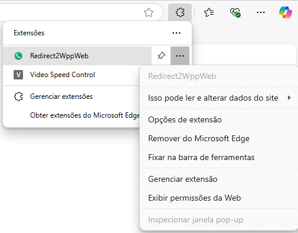
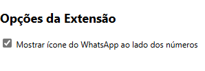
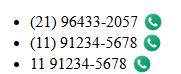

# 📲 Redirect2WppWeb

**Redirect2WppWeb** é uma extensão para navegadores (Edge, Brave, Chrome) que transforma números de celular em links clicáveis para o WhatsApp Web — e ainda oferece um menu de atalho via clique com o botão direito.

---

## 🚀 Funcionalidades

- 🔍 Detecta automaticamente números de celular com DDD válidos na página.
- 🟢 Exibe um **ícone do WhatsApp** ao lado do número (opcional).
- 🖱 Permite redirecionar para o WhatsApp Web ao **clicar com o botão direito** sobre um número selecionado.
- ⚙️ Configuração para **habilitar/desabilitar ícones** diretamente nas opções da extensão.

---

## 🧩 Como usar

### ✅ 1. Baixar a extensão

1. Acesse `chrome://extensions` (edge: `edge://extensions`, firefox: `https://addons.mozilla.org/en-US/firefox/extensions`).
2. Busque a extensão **Redirect2WppWeb**.
3. Instale a extensão.

---

### 🟢 2. Habilitar os ícones (opcional)

Se quiser ver o ícone de WhatsApp ao lado dos números, ative nas opções da extensão:

- Clique no ícone da extensão > **Opções da extensão**

- Marque a caixa:

---

### 🔎 3. Veja o ícone ao lado dos números válidos

Ao acessar uma página que contenha números como:

- `(21) 91483-6747`
- `(11) 91234-5678`

O resultado será:

> Somente números com DDD e iniciados com 9, com formatação legível, terão ícone.

---

### 🖱 4. Clique com o botão direito para enviar no WhatsApp

1. Selecione um número na página.
2. Clique com o **botão direito**.
3. Clique em **“Abrir no WhatsApp Web”**:

---

## ⚠️ Formatos aceitos

Apenas números de celular com DDD, iniciados com 9 e formatados de forma legível:

✔️ Válidos:
- `(21) 96123-1548`
- `+55 (11) 91234-5678`

❌ Ignorados:
- `1198765-4321`
- `21998765432`
- `11912345678`

---

## 🌍 Compatível com:

- Microsoft Edge ✅
- Chrome ✅
- Brave ✅
- Firefox ✅ (com pequeno ajuste em permissões)

---

# Política de Privacidade — Redirect2WppWeb

A extensão Redirect2WppWeb respeita sua privacidade. Nenhuma informação pessoal é coletada, armazenada ou compartilhada com terceiros.

## O que a extensão faz?

- Detecta números de telefone visíveis em páginas da web.
- Gera um botão para abrir o WhatsApp Web com aquele número.
- Permite redirecionamento via menu do botão direito.

## O que ela **não** faz:

- ❌ Não coleta dados pessoais.
- ❌ Não envia dados para servidores.
- ❌ Não usa cookies.
- ❌ Não rastreia navegação.
- ❌ Não integra com sistemas de terceiros.

---

## 📄 Licença

MIT © 2025
